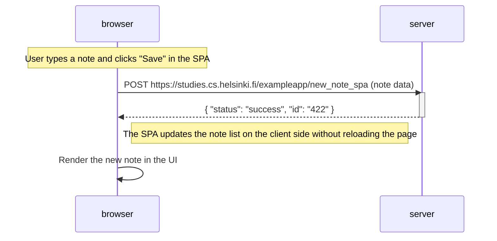

```mermaid
sequenceDiagram
    participant browser
    participant server

    Note over browser: User types a note and clicks "Save" in the SPA

    browser->>server: POST https://studies.cs.helsinki.fi/exampleapp/new_note_spa (note data)
    activate server
    server-->>browser: { "status": "success", "id": "422" }
    deactivate server

    Note right of browser: The SPA updates the note list on the client side without reloading the page
    browser->>browser: Render the new note in the UI
```
